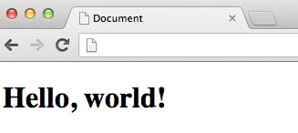

# Introduction

During this bootcamp, you will be creating webpages with HTML, CSS and JS. We want everyone to leave this bootcamp with a webpage they have created.

If you have never written a line of code in your life, don't worry. This booklet
contains the code for several fun projects. You just need to copy the code
exactly as it is written on paper into your computer.

As you do this, you are bound to make mistakes. This is normal. We hope that as
you fix your mistakes, you will also learn about coding.

You can do these projects in any order, but we recommend that you start with the
"Hello World" and "Hello World, Again" projects.

While you are working, try to think of ways you can customize these projects.
For example, you might change the colors or the styling. Or you could combine
features from multiple projects into one. Or maybe you can find some code on the
Internet that you'd like to incorporate. Be as creative as you'd like!

We would like to encourage everyone to work together and help each other as
much as possible. Learning to code is difficult, but it is much easier when
you work together.

We would also like to encourage everyone to research online. There is a wealth
of information available online for all the topics we will be covering. Here are
a few helpful sites, but feel free to google for more.

 * www.stackoverflow.com
 * www.w3schools.com
 * www.codecademy.com

# Hello World

In this project, you will first get set up with your development environment. We will be building webpages, so you will need to use a browser to view them in. We recommend Google Chrome. Install the Google Chrome browser if you do not already have it. You'll also need a way to write, save, and edit text files.

Your first webpage is a Hello World page that says "Hello, world!". This page will introduce the basic structure of a HTML document.

<div class='break'></div>

## Core Concepts

  * Installing Chrome
  * Finding a text editor
  * HTML

## Getting Started

First, download and install the Chrome Web Browser from here: https://www.google.com/intl/en/chrome/browser/.

If you have a text editor of choice, feel free to use it. If not, we recommend Textmate or Sublime, which you can get here: http://www.sublimetext.com/ or http://macromates.com.

In the rest of this packet, we will provide you with the necessary text files for your first webpage. 

1. Create a folder on your computer called hello_world.
2. For each of the files below, create a new file in your text editor. 

Be sure to name the files as they appear below. Remember to save your files (NOTE: an asterisk or dot by the file name means your changes have not been saved)!

<div class='break'></div>

## Source Files

*index.html*

This file describes our webpage.

```html
<!DOCTYPE html>
<html>
  <!-- This is an HTML comment. You do not need to copy these. -->
  <head>
	<!-- Anything in here is not visible in the page itself -->
	<meta charset="UTF-8" />
	<title>My First Webpage</title>
  </head>
  <!-- This block contains the primary content of the page. -->
  <body>
    <h1 style="color:black">Hello, world!</h1>
  </body>
</html>
```

## Viewing your webpage

To view your webpage, 

1. Open the Chrome browser. 
2. Click File > Open
3. Navigate to your hello_world folder and select the index.html file

You should see your webpage appear in the Chrome browser window. This page should contain just "Hello, world!" in large, black text.



If your page doesn't look like the above, check that your code exactly matches the example. Don't hesitate to ask for help if you get stuck. To ask for help, find a volunteer.

## See what you can do!

  - Say "Hello, [your name]!" instead of "Hello, world!"
  - Change the color of the text.
